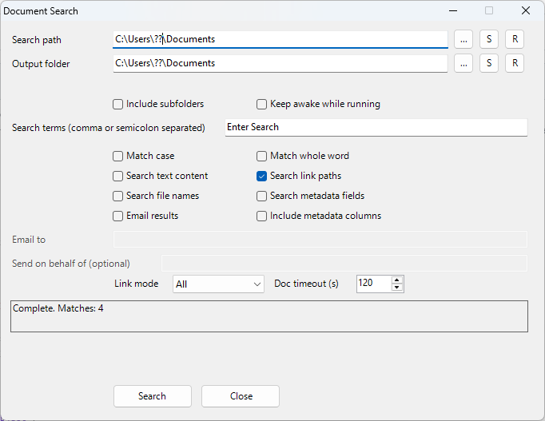

# DocumentSuperSearch
Supersearch is a PowerShell-based document discovery tool for Word files. It searches body text, hyperlinks, and key metadata fields, then exports results to a structured Excel report. This makes it ideal for governance and audit workflows where documents must be grouped or validated by metadata such as Summary, Tags, or Enterprise Keywords.

Supersearch is a PowerShell-based document discovery tool for Word files. It searches body text, hyperlinks, paths, and key metadata fields, then exports results to a structured Excel report. This makes it ideal for governance and audit workflows where documents must be grouped or validated by metadata such as Summary, Tags, or Enterprise Keywords.

The output file is audit-friendly because it:
- Captures **where each match was found** (body, metadata field, or link)
- Normalizes metadata into consistent columns for easy filtering/grouping
- Enables quick review of compliance or inventory gaps across large libraries


# Supersearch (Search.ps1) README

This document explains how to install and use the Supersearch tool, including the GUI and key options.

---

## Contents

1. Overview
2. Screenshots
3. Install / Setup
4. GUI Usage (Search-Gui.ps1)
5. CLI Usage (Search.ps1)
6. Output File Details
7. Email Results (Outlook)
8. Sleep Prevention
9. Troubleshooting
10. Known Issues

---

## 1) Overview

Supersearch scans Word documents for terms in:
- Document body text
- Hyperlink paths
- Metadata fields (Doc-ID, Summary, Notes, Tags, Enterprise Keywords, Author)

Results are saved to an Excel file and can be emailed via Outlook.

---

## 2) Screenshots

- Main window (no options checked):
  

- Email results enabled:
  

---

## 3) Install / Setup

1) Place these files in one folder:
   - Search.ps1
   - Search-Gui.ps1
   - Search-Gui-Launcher.cmd (optional, may be blocked in some environments)
   - Create-SearchGui-Shortcut.ps1 (optional)

2) Run the GUI:
   - Preferred: double-click Search-Gui-Launcher.cmd
   - Or run Search-Gui.ps1 from PowerShell

3) (Optional) Create a desktop shortcut:
   - Run:
     ```powershell
     .\Create-SearchGui-Shortcut.ps1
     ```
   - This creates a shortcut named "Search GUI" on the desktop.

Note: Some corporate environments block .cmd. The shortcut script creates a shortcut directly to powershell.exe and does not require .cmd.

---

## 3a) Using SharePoint libraries (sync locally)

This tool searches **local files**, so SharePoint libraries must be synced to your computer first.

Steps (Microsoft 365 / OneDrive):

1) Open the SharePoint document library in your browser.
2) Click **Sync** in the command bar.
3) Approve opening OneDrive (if prompted).
4) Wait for the library to appear in File Explorer under your organization name.

Once synced, use the **local folder path** as your Search path in the GUI.

Tip: The library path typically looks like:
```
C:\Users\<you>\Your Org Name\Library Name
```

---

## 4) GUI Usage (Search-Gui.ps1)

### Path controls
- Search path: the folder (or file) to scan.
- Output folder: where the Excel report is saved.

Buttons (per path):
- "..." = browse
- "S" = save the current field as the default
- "R" = reset to Documents

Defaults are stored in:
```
Search-Gui-Settings.json
```

### Search options
- Include subfolders
- Search text content
- Search link paths
- Search metadata fields
- Include metadata columns
- Match case
- Match whole word
- Keep awake while running
- Search file names

### Email options
Check "Email results" and fill in:
- Email to
- Send on behalf of (optional)

Email is sent through Outlook.

---

## 5) CLI Usage (Search.ps1)

You can run the search directly from PowerShell:

```powershell
.\Search.ps1
```

Or call the function with options:

```powershell
Invoke-DocumentSearch `
  -Path "C:\Docs" `
  -FindTerms @("term1","term2") `
  -IncludeSubfolders $true `
  -SearchMetadata $true `
  -IncludeMetadataColumns $true `
  -SendEmailResults $false `
  -OutputDirectory ([Environment]::GetFolderPath('MyDocuments'))
```

Key parameters:
- Path
- FindTerms
- MatchCase
- MatchWholeWord
- SearchTextContent
- SearchLinkPaths
- SearchMetadata
- SearchFileName
- IncludeMetadataColumns
- IncludeSubfolders
- PreventSleep
- SendEmailResults
- EmailTo
- EmailFrom
- OutputDirectory

---

## 6) Output File Details

The report is saved as an Excel file with a name based on the search terms and date:
```
Search results - term1, term2 - yyyy-MM-dd.xlsx
```

### Column order (metadata on)
1. MatchedTerms
2. Found
3. Doc-ID
4. FileName
5. FullPath
6. Author
7. Notes
8. Summary
9. Tags
10. Enterprise Keywords

### "Found" column
Shows where the match occurred:
```
Filename; Body; Link; Doc-ID; Summary; Notes; Tags; Enterprise Keywords; Author
```

---

## 7) Email Results (Outlook)

Email is sent via Outlook (no SMTP needed).

Set in GUI:
- Email results: checked
- Email to: one or more recipients
- Send on behalf of: optional

---

## 8) Sleep Prevention

To keep the machine awake during a long scan:
- GUI: "Keep awake while running" (checked by default)
- CLI: -PreventSleep $true

This prevents sleep and display sleep while the script runs.

---

## 9) Troubleshooting

### Output file not updating
Close the Excel report before running. If the file is open, the script will stop and ask you to close it.

### GUI changes not showing
Close and re-open the GUI. It loads Search.ps1 on startup.

### Metadata not found
Some documents do not contain all metadata fields. Empty fields are normal.

### Corporate security blocks .cmd
Use the shortcut generator. It creates a shortcut to powershell.exe directly.

## 10) Known Issues 
